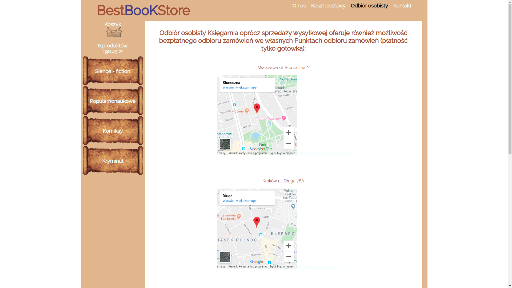
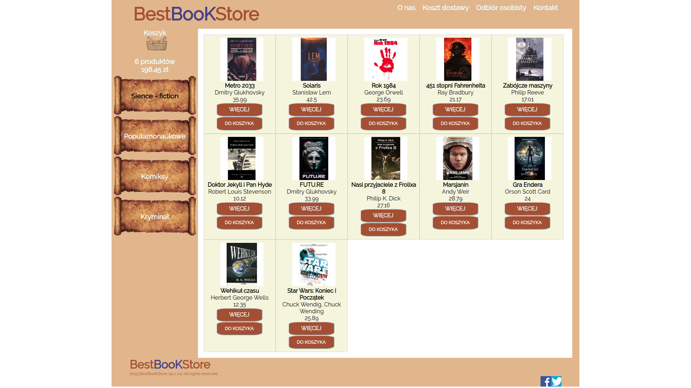
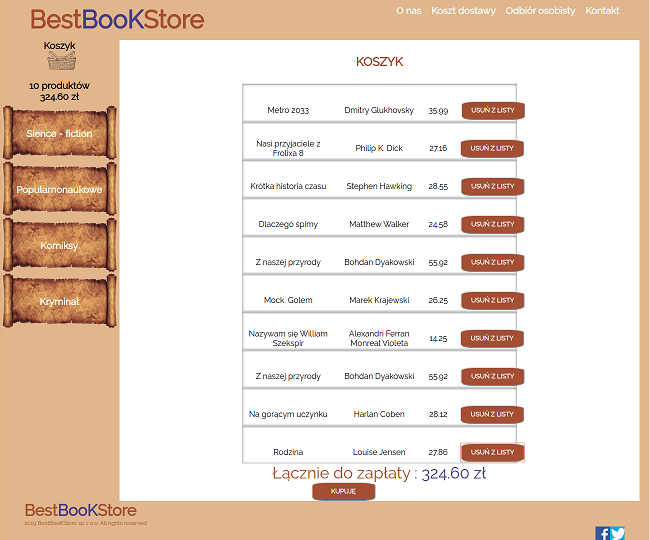
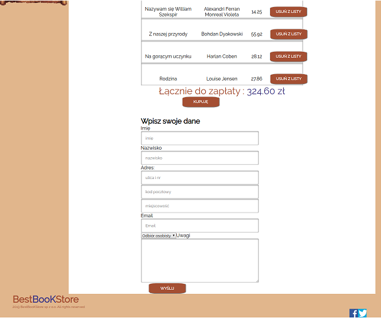

#Projekt księgarni internetowej.
Projekt został stworzony dzięki takim narzędziom jak:
-React
-React Router
-Sass

Strona zawiera podstawowe informacje o księgarni

Książki na stronie podzielone są na cztery kategorie.
Informacje o książkach pobierane są poprzez fetch z pliku JSON z obiektu books

W zakładkach wyświetlane są informacje o książkach, możliwość wyświetlenia opisu ksiązki oraz dodanie do koszyka.

Po wejściu w zakładkę koszyk, użytkownik wypełnia formulaż ze swoimi danymi, następnie dane te wysyłane są do pliku JSON do obiektu orders.

## Instrukcje

- uruchom JSON Server, w katalogu JSON: json-server --watch db.json
- w głównym katalogu zainstaluj i uruchom webpack: npm install, npn run start

